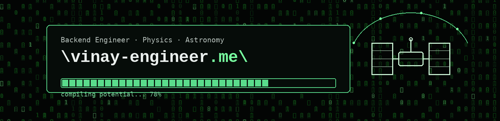

 

---

### 🛠️ Languages and Tools

  

  

---

### 📊 GitHub Stats

  
  

  

---

### Projects

#### [Orbica](https://github.com/viny4/orbica) — [orbica.space](https://orbica.space)
An encyclopedia of every rocket and satellite launched since 1957, with live orbit tracking.
Timeline → agency → rocket → 3D model → satellites it launched → real-time 3D orbit, as one
connected graph. Next.js + React Three Fiber on Cloudflare Pages, Go API (Fiber, pgx),
WebSocket streaming of live SGP4 positions, PostgreSQL.

#### [Nexora](https://github.com/viny4/nexora-saas-platform) — Multi-tenant SaaS billing platform
Tenant isolation through PostgreSQL Row Level Security. Atomic credit/debit under SERIALIZABLE
isolation with advisory locks. Partitioned audit logs, materialized views, GIN indexes,
LISTEN/NOTIFY for event-driven processing. Streaming replication with PgBouncer pooling,
instrumented with Prometheus and Grafana. NestJS, TypeScript, Prisma, PostgreSQL 16, Redis.

#### [Backend Masterclass](https://github.com/viny4/Backend-Masterclass) — Django REST + FastAPI
JWT auth with a multi-role user system, blog engine, Celery task queue, and a FastAPI service
handling WebSocket chat and HTTP Range video streaming. Django REST Framework, FastAPI, Celery,
Docker.

#### [Movie Knowledge Graph](https://github.com/viny4/movie-knowledge-graph) — Neo4j / Cypher
Films, actors, directors, genres and studios as nodes and relationships rather than tables —
queries traverse the graph instead of joining. Node.js, TypeScript, Express, neo4j-driver, Zod.

#### [Panebox](https://github.com/viny4/panebox) — Desktop deck for AI tools
ChatGPT, Claude, Gemini, Perplexity and ~50 more, each in an isolated session, in one window.
Per-service isolation means two accounts of the same tool run side by side. JavaScript, Electron.

---

### Stack

**Languages** Python · TypeScript · Go · JavaScript · C#
**Backend** Django / DRF · FastAPI · NestJS · Express · Next.js
**Data** PostgreSQL · Neo4j · Redis · Prisma
**Infra** Docker · Cloudflare · AWS · Prometheus / Grafana · GitHub Actions

---

### Previously

Backend engineering at [Thaagam Foundation](https://github.com/thaagamfoundationngo) — WhatsApp
Business API integration, automated payment flows, and volunteer management systems on Django.

> Much of my 2025 work lives in private organizational repositories I no longer have access to,
> so it isn't reflected in the contribution graph below.

---

[Portfolio](https://vinay-engineer.me) · [LinkedIn](https://linkedin.com/in/vinjr) · [ORCID](https://orcid.org/0009-0008-8362-1908)

